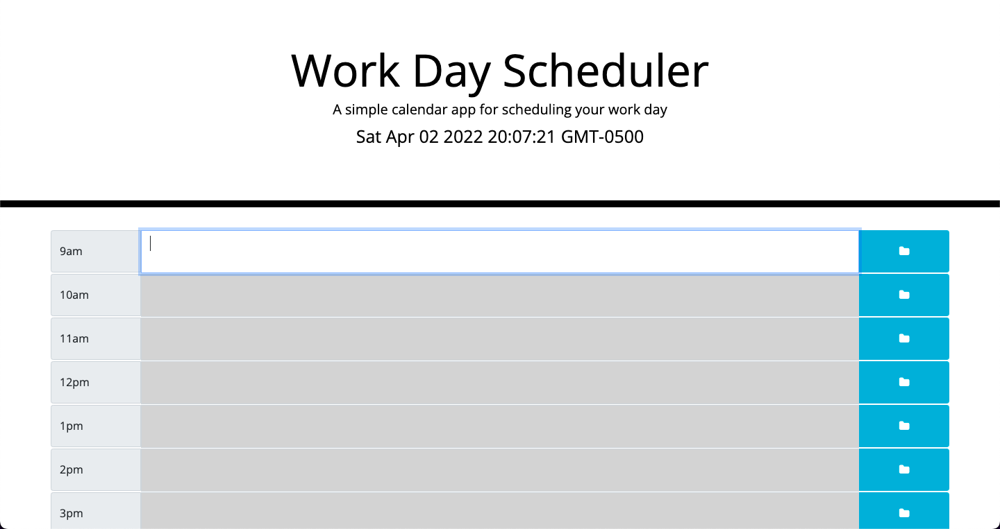

# Weekday-Hourly-Todo-List

## Description

Need to stay orgnaized during the work day? Use this hourly todo list to help! This helps you see what time of the day it is by showing future time with a red bckground, past time with a grey background, and current time with a green background. All items will be saved in your local storage until you having cleared them from your to dos!

## Installation

https://jordond27.github.io/weekday-hourly-todo/

## Usage

Click the textare next to the time of day you want to write a to do item and then the blue save button. This will save the text to your local storage drive until you change the text.

## Badges

